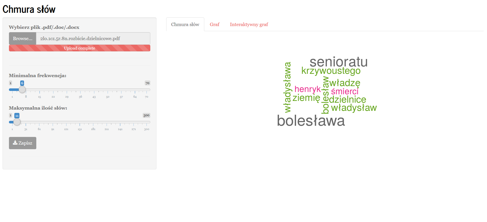
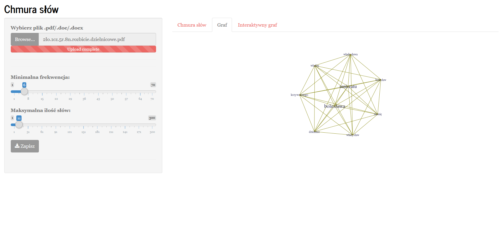
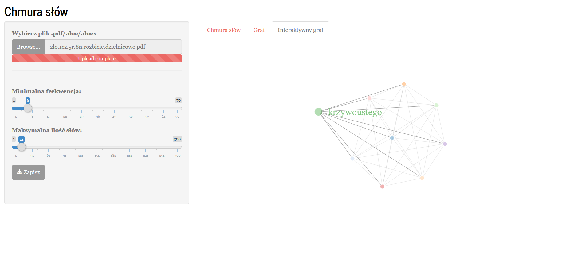

# wordcloud-graphs

1. Generate wordcloud and graphs from **.pdf**, **.doc**, **.docx**, **.txt** or **.html**.
2. Save wordcloud to **.png**.

> **Full version is available at [`shinyapps.io` server](https://robertjankowski.shinyapps.io/wordcloud-app/)**

Based on [shiny example](https://shiny.rstudio.com/gallery/word-cloud.html).

### Examples

***
**Wordcloud**

***
**Graph**

***
**Interactive graph**

### Acknowledgments
The purpose of this project was to give my mum a tool which will be good addition to history lessons.

### Licence
[MIT License](https://opensource.org/licenses/MIT)
